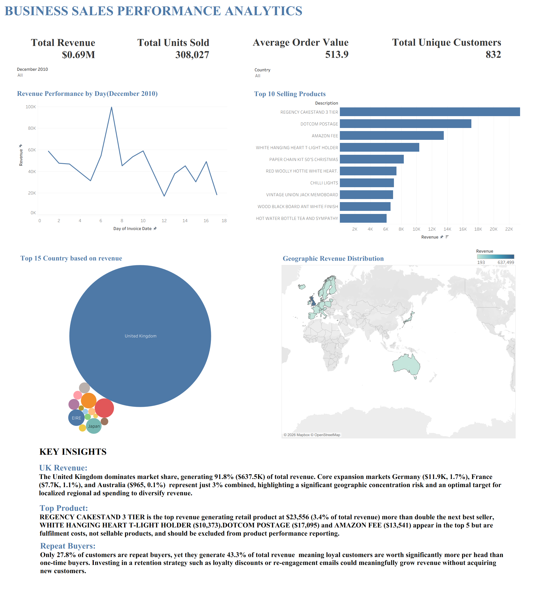

# 📊 Business Sales Performance Analytics

A end-to-end data analytics project covering data cleaning, exploratory analysis, and an interactive Tableau dashboard built on a real-world online retail dataset.



---

## 🗂️ Project Overview

This project analyzes global e-commerce sales data for **December 2010**, transforming raw transactional records into actionable business insights. It covers the full analytics pipeline — from data wrangling in Python to a polished Tableau dashboard with KPIs, trend analysis, and geographic breakdowns.

**Reporting Period:** December 2010  
**Data Source:** UCI Online Retail Dataset (`online_retail_cleaned.csv`)  
**Prepared by:** Neethu O S

---

## 📁 Repository Structure

```
├── Task1.ipynb                        # Data cleaning & preprocessing (Python)
├── online_retail_cleaned__1_.csv      # Cleaned dataset
├── Task01.twb                         # Tableau workbook (dashboard)
├── Dashboard.png                      # Dashboard screenshot
└── BUSINESS_SALES_PERFORMANCE_REPORT.pdf  # Full analytical report
```

---

## 🔑 Key Metrics

| Metric | Value |
|---|---|
| Total Revenue | $694,817 |
| Total Units Sold | 308,027 |
| Unique Customers | 832 |
| Average Order Value | $513.92 |

---

## 🧹 Data Cleaning (Python)

The notebook `Task1.ipynb` handles all preprocessing on the raw retail CSV:

- Parsed and standardized `InvoiceDate` to datetime format
- Removed cancelled orders (invoices prefixed with `C`)
- Filtered out rows with zero or negative `Quantity` / `UnitPrice`
- Filled missing product descriptions with `"UNKNOWN ITEM"`
- Dropped duplicate records
- Engineered a `Revenue` column (`Quantity × UnitPrice`)
- Exported the cleaned dataset to `online_retail_cleaned.csv`

**Libraries used:** `pandas`, `numpy`

---

## 📈 Dashboard (Tableau)

The Tableau workbook (`Task01.twb`) contains an interactive dashboard with:

- **Revenue by Day** — Daily sales trend line for December 2010
- **Top 10 Products** — Ranked by total revenue
- **Top 15 Countries** — Bubble chart by revenue contribution
- **Geographic Revenue Map** — Global heat map of sales distribution
- **KPI Banner** — Total Revenue, Units Sold, AOV, Unique Customers

Filters available for **Month** and **Country**.

---

## 💡 Key Insights

**UK Dominance** — The United Kingdom accounts for 91.8% ($637.5K) of total revenue, representing a significant geographic concentration risk. Germany, France, and EIRE are the strongest secondary markets but together contribute less than 9%.

**Top Product** — *REGENCY CAKESTAND 3 TIER* is the highest-revenue retail product at $23,556. Note: *DOTCOM POSTAGE* ($17,095) and *AMAZON FEE* ($13,541) appear in the top 5 but represent fulfilment costs, not sellable products.

**Repeat Buyers** — Only 27.8% of customers are repeat buyers, yet they drive 43.3% of total revenue — making retention the single highest-leverage growth lever.

---

## ✅ Strategic Recommendations

1. **Launch a retention funnel** — Trigger a post-purchase email sequence 14 days after a first order, offering personalized discounts and cross-sell recommendations.
2. **Diversify geographic risk** — Redirect ~15% of ad spend to Germany and France to build regional revenue buffers beyond the UK.
3. **Optimize product placement** — Feature top-performing items like the Regency Cakestand prominently on the storefront, and review logistics costs to reduce shipping-driven cart abandonment.

---

## 🛠️ Tools & Technologies


---

## 📄 License

This project is for educational and portfolio purposes.
